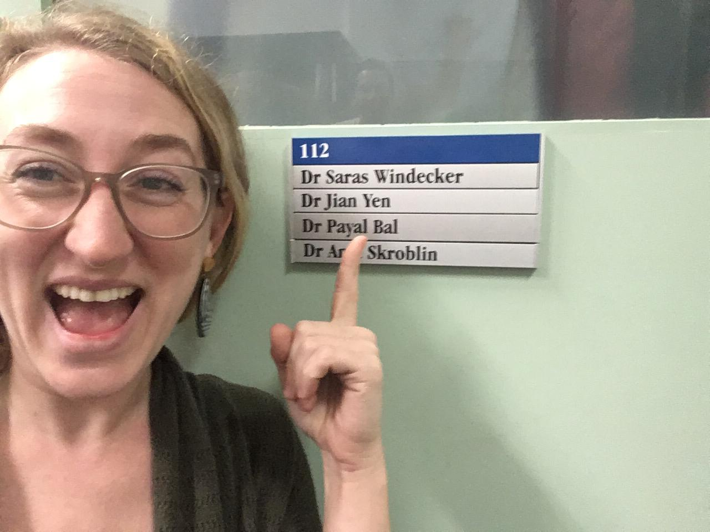
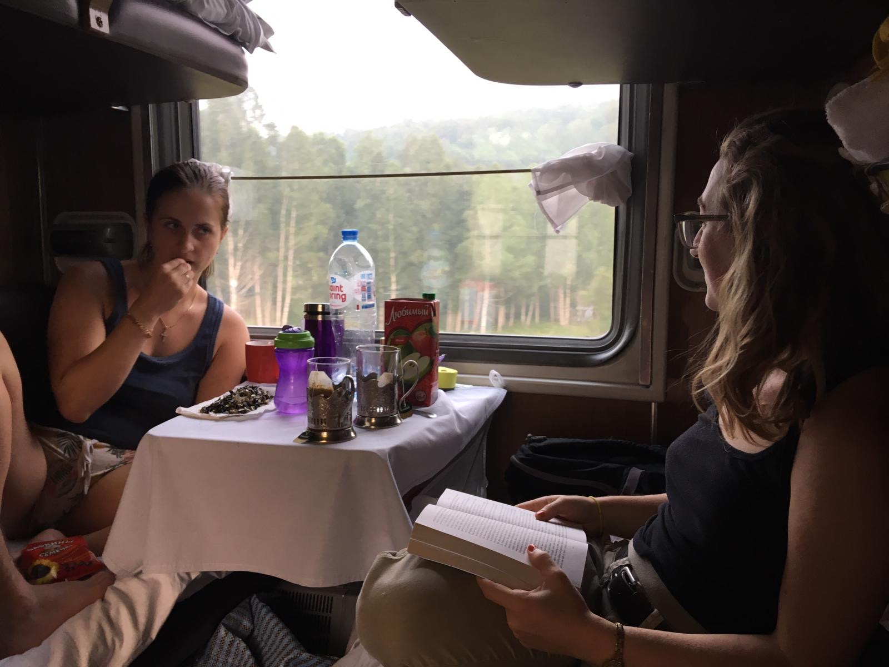
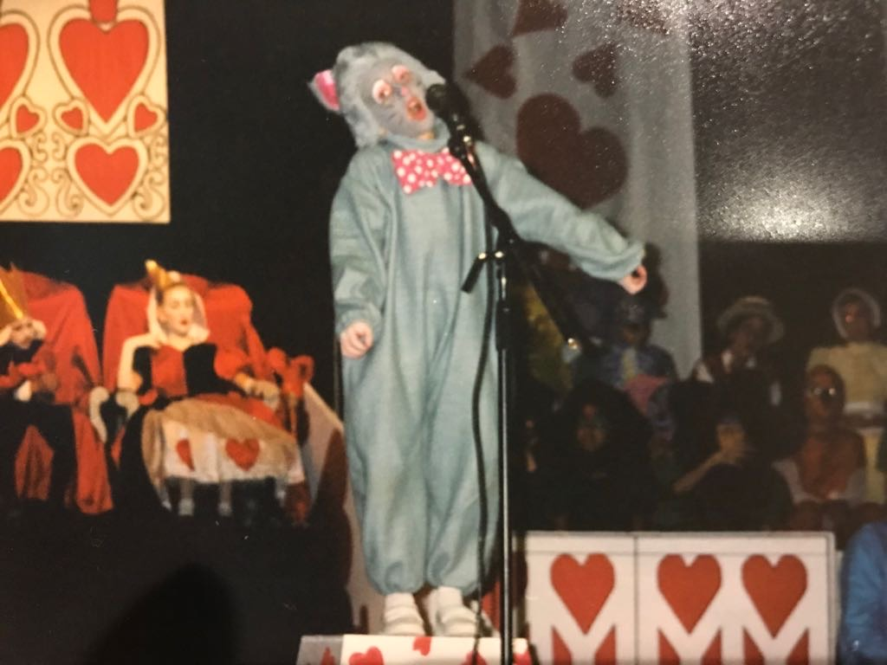

Hi there! 

I'm Saras. Last year I set myself a few about-to-turn-thirty goals. I planned to finish my PhD (check! see exhibit A. OMG that was hard) and do my first bike-packing trip (250 km over four days... check!!) I've had a lot of fun this year, and with a shiny new job under my belt, I decided it was time to set a goal that was more about giving back to the community. So this year, I'm starting this blog to share live-code demos in R and fundraise for causes I care about. I'll be sharing videos on topics such as reproducible code and Bayesian stats. 

Exhibit A. A glorious day

When I first finished my PhD, I spent my newfound extra time and energy studying Russian, reading Checkhov, and learning about the Russian Revolution in preparation to take the Transiberian railroad for my post-thesis holiday (exhibit B. It was incredible). I was extremely fortunate to have had some wonderful mentors during my PhD, from whom I learned a lot, and also landed a wonderful postdoc. I'm aware of what a privileged position I'm in to be in a secure, well-paid (thank you Australia), and fulfilling work position (I'm building models for public health prediction! How forking cool!) So although I have set my sights on plenty of other trips and languages, it's time to put my free time and skills to some philanthropic use..

Exhibit B. We got along better than it looks.

 
So what are my skills? I'm told I explain concepts in an approachable and friendly manner and public speaking brings me joy =) In fact, teaching R may be the closest I'll get to putting my prolific childhood acting joy to use in adult life (exhibit C. You're welcome).

Exhibit C. The pinnacle of my young life.

Which brings me to the conclusion that at this point (incredibly), coding and stats skills seem to be what I can best offer the world. Until such time as I develop more interesting skills, here is my offering: come and listen/watch me demo interesting coding things, and donate, if you like. Thanks for reading,

Saras

